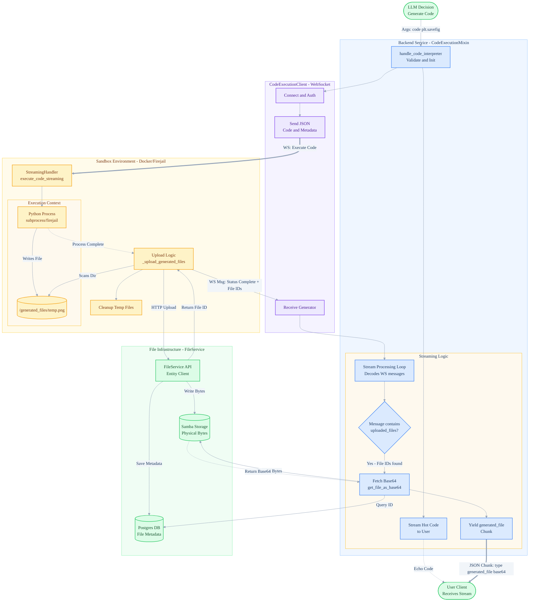

```mermaid
%%{init: {
  "theme": "base",
  "themeVariables": {
    "background": "#f8f9fc",
    "primaryColor": "#dbeafe",
    "primaryTextColor": "#1e3a5f",
    "primaryBorderColor": "#3b82f6",
    "secondaryColor": "#fef3c7",
    "secondaryTextColor": "#78350f",
    "secondaryBorderColor": "#f59e0b",
    "tertiaryColor": "#ede9fe",
    "tertiaryTextColor": "#4c1d95",
    "tertiaryBorderColor": "#7c3aed",
    "nodeTextColor": "#1e293b",
    "edgeLabelBackground": "#f1f5f9",
    "clusterBkg": "#f8faff",
    "clusterBorder": "#cbd5e1",
    "titleColor": "#1e293b",
    "lineColor": "#94a3b8",
    "fontSize": "16px",
    "fontFamily": "Georgia, serif"
  }
}}%%
graph TD
    LLM([LLM Decision\nGenerate Code])
    User([User Client\nReceives Stream])

    subgraph Backend ["Backend Service - CodeExecutionMixin"]
        direction TB
        MixinStart[handle_code_interpreter\nValidate and Init]

        subgraph StreamLogic ["Streaming Logic"]
            HotCode[Stream Hot Code\nto User]
            ProcessStream[Stream Processing Loop\nDecodes WS messages]
            CheckFiles{Message contains\nuploaded_files?}
            FetchB64[Fetch Base64\nget_file_as_base64]
            YieldFile[Yield generated_file\nChunk]
        end
    end

    subgraph Bridge ["CodeExecutionClient - WebSocket"]
        WS_Connect[Connect and Auth]
        WS_Send[Send JSON\nCode and Metadata]
        WS_Recv[Receive Generator]
    end

    subgraph SandboxEnv ["Sandbox Environment - Docker/Firejail"]
        direction TB
        Handler[StreamingHandler\nexecute_code_streaming]

        subgraph ExecProcess ["Execution Context"]
            PythonProc[Python Process\nsubprocess/firejail]
            LocalDisk[(/generated_files/temp.png)]
        end

        FileDetector[Upload Logic\n_upload_generated_files]
        Cleanup[Cleanup Temp Files]
    end

    subgraph Infra ["File Infrastructure - FileService"]
        direction TB
        FileAPI[FileService API\nEntity Client]
        DB[(Postgres DB\nFile Metadata)]
        Samba[(Samba Storage\nPhysical Bytes)]
    end

    LLM --> |"Args: code plt.savefig"| MixinStart
    MixinStart --> HotCode
    HotCode -.-> |"Echo Code"| User
    MixinStart --> WS_Connect
    WS_Connect --> WS_Send

    WS_Send ==> |"WS: Execute Code"| Handler
    Handler --> PythonProc
    PythonProc -- "Writes File" --> LocalDisk

    PythonProc -.-> |"Process Complete"| FileDetector
    FileDetector -- "Scans Dir" --> LocalDisk
    FileDetector -- "HTTP Upload" --> FileAPI

    FileAPI --> |"Save Metadata"| DB
    FileAPI --> |"Write Bytes"| Samba
    FileAPI -- "Return File ID" --> FileDetector

    FileDetector --> Cleanup
    FileDetector -- "WS Msg: Status Complete + File IDs" --> WS_Recv
    WS_Recv --> ProcessStream

    ProcessStream --> CheckFiles
    CheckFiles -- "Yes - File IDs found" --> FetchB64

    FetchB64 -- "Query ID" --> DB
    FetchB64 -- "Read Bytes" --> Samba
    Samba -.-> |"Return Base64"| FetchB64

    FetchB64 --> YieldFile
    YieldFile ==> |"JSON Chunk: type generated_file base64"| User

    %% Backend: soft blue
    classDef main fill:#dbeafe,stroke:#3b82f6,stroke-width:1.5px,color:#1e3a5f

    %% Sandbox: soft amber
    classDef worker fill:#fef3c7,stroke:#f59e0b,stroke-width:1.5px,color:#78350f

    %% Bridge: soft violet
    classDef bridge fill:#ede9fe,stroke:#7c3aed,stroke-width:1.5px,color:#4c1d95

    %% External/Infra: soft green
    classDef external fill:#dcfce7,stroke:#22c55e,stroke-width:1.5px,color:#14532d

    class MixinStart,ProcessStream,CheckFiles,FetchB64,YieldFile,HotCode main
    class Handler,PythonProc,FileDetector,Cleanup,LocalDisk worker
    class WS_Connect,WS_Send,WS_Recv bridge
    class LLM,User,FileAPI,DB,Samba external

    style Backend fill:#eff6ff,stroke:#93c5fd,color:#1e3a5f
    style StreamLogic fill:#fef9ee,stroke:#fbbf24,color:#1e3a5f
    style Bridge fill:#f5f3ff,stroke:#a78bfa,color:#4c1d95
    style SandboxEnv fill:#fffbeb,stroke:#fcd34d,color:#78350f
    style ExecProcess fill:#fef9ee,stroke:#fbbf24,color:#78350f
    style Infra fill:#f0fdf4,stroke:#86efac,color:#14532d
```