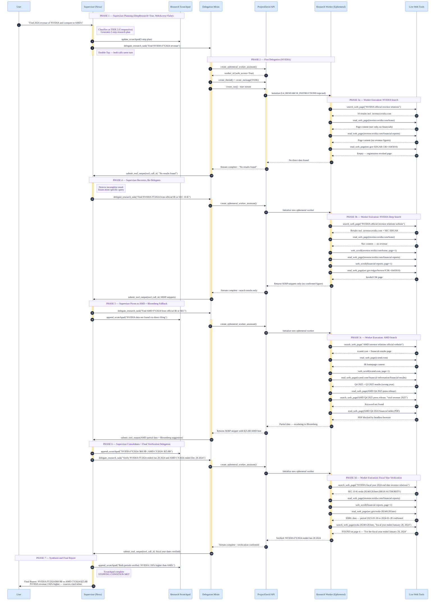

---

title: Deep Research Sequence
category: architecture
slug: archi-deep-research-sequence

---

```mermaid
%%{init: {
  "theme": "base",
  "themeVariables": {
    "background": "#f8f9fc",
    "primaryColor": "#dbeafe",
    "primaryTextColor": "#1e3a5f",
    "primaryBorderColor": "#3b82f6",
    "secondaryColor": "#fef3c7",
    "secondaryTextColor": "#78350f",
    "secondaryBorderColor": "#f59e0b",
    "tertiaryColor": "#dcfce7",
    "tertiaryTextColor": "#14532d",
    "tertiaryBorderColor": "#22c55e",
    "actorBkg": "#dbeafe",
    "actorBorder": "#3b82f6",
    "actorTextColor": "#1e3a5f",
    "actorLineColor": "#94a3b8",
    "signalColor": "#1e293b",
    "signalTextColor": "#1e293b",
    "labelBoxBkgColor": "#eff6ff",
    "labelBoxBorderColor": "#93c5fd",
    "labelTextColor": "#1e3a5f",
    "loopTextColor": "#78350f",
    "noteBkgColor": "#f5f3ff",
    "noteTextColor": "#4c1d95",
    "noteBorderColor": "#a78bfa",
    "activationBkgColor": "#fef3c7",
    "activationBorderColor": "#f59e0b",
    "sequenceNumberColor": "#ffffff",
    "edgeLabelBackground": "#f1f5f9",
    "fontSize": "18px",
    "fontFamily": "Georgia, serif"
  }
}}%%
sequenceDiagram
    autonumber
    participant User
    participant Supervisor as Supervisor (Nexa)
    participant Scratchpad as Research Scratchpad
    participant Mixin as Delegation Mixin
    participant WorkerAPI as ProjectDavid API
    participant Worker as Research Worker (Ephemeral)
    participant Web as Live Web Tools

    Note over Supervisor, Scratchpad: PHASE 1 — Supervisor Planning (DeepResearch=True, WebAccess=False)

    User->>Supervisor: "Find 2024 revenue of NVIDIA and compare to AMD's"
    activate Supervisor
    Note right of Supervisor: Classifies as TIER 2 (Comparative)<br/>Generates 5-step research plan
    Supervisor->>Scratchpad: update_scratchpad(5-step plan)
    Supervisor->>Mixin: delegate_research_task("Find NVIDIA FY2024 revenue")
    Note right of Supervisor: Double-Tap — both calls same turn
    deactivate Supervisor

    Note over Mixin, Worker: PHASE 2 — First Delegation (NVIDIA)

    activate Mixin
    Mixin->>WorkerAPI: create_ephemeral_worker_assistant()
    WorkerAPI-->>Mixin: worker_id (web_access=True)
    Mixin->>WorkerAPI: create_thread() + create_message(TASK)
    Mixin->>WorkerAPI: create_run() - start stream
    activate WorkerAPI
    WorkerAPI->>Worker: Initialize (L4_RESEARCH_INSTRUCTIONS injected)
    activate Worker

    Note over Worker, Web: PHASE 3a — Worker Execution: NVIDIA Search

    Worker->>Web: search_web_page("NVIDIA official investor relations")
    Web-->>Worker: 10 results incl. investor.nvidia.com
    Worker->>Web: read_web_page(investor.nvidia.com/home)
    Web-->>Worker: Page content (nav only, no financials)
    Worker->>Web: read_web_page(investor.nvidia.com/financial-reports)
    Web-->>Worker: Page content (no revenue figures)
    Worker->>Web: read_web_page(sec.gov EDGAR CIK=1045810)
    Web-->>Worker: Empty — registration revoked page
    Worker-->>WorkerAPI: No direct data found
    deactivate Worker
    WorkerAPI-->>Mixin: Stream complete - "No results found"
    deactivate WorkerAPI
    Mixin->>Supervisor: submit_tool_output(tool_call_id, "No results found")
    deactivate Mixin

    Note over Supervisor, Scratchpad: PHASE 4 — Supervisor Recovers, Re-Delegates

    activate Supervisor
    Note right of Supervisor: Detects incomplete result<br/>Issues more specific query
    Supervisor->>Mixin: delegate_research_task("Find NVIDIA FY2024 from official IR or SEC 10-K")
    deactivate Supervisor

    activate Mixin
    Mixin->>WorkerAPI: create_ephemeral_worker_assistant() #2
    WorkerAPI->>Worker: Initialize new ephemeral worker
    activate Worker

    Note over Worker, Web: PHASE 3b — Worker Execution: NVIDIA Deep Search

    Worker->>Web: search_web_page("NVIDIA official investor relations website")
    Web-->>Worker: Results incl. investor.nvidia.com + SEC EDGAR
    Worker->>Web: read_web_page(investor.nvidia.com/home)
    Web-->>Worker: Nav content — no revenue
    Worker->>Web: web_scroll(investor.nvidia.com/home, page=1)
    Worker->>Web: read_web_page(investor.nvidia.com/financial-reports)
    Worker->>Web: web_scroll(financial-reports, page=1)
    Worker->>Web: read_web_page(sec.gov/edgar/browse?CIK=1045810)
    Web-->>Worker: Invalid CIK page
    Worker-->>WorkerAPI: Returns SERP snippets only (no confirmed figure)
    deactivate Worker
    WorkerAPI-->>Mixin: Stream complete - search results only
    Mixin->>Supervisor: submit_tool_output(tool_call_id, SERP snippets)
    deactivate Mixin

    Note over Supervisor, Scratchpad: PHASE 5 — Supervisor Pivots to AMD + Bloomberg Fallback

    activate Supervisor
    Supervisor->>Mixin: delegate_research_task("Find AMD FY2024 from official IR or SEC")
    Supervisor->>Scratchpad: append_scratchpad("NVIDIA data not found via direct filing")
    deactivate Supervisor

    activate Mixin
    Mixin->>WorkerAPI: create_ephemeral_worker_assistant() #3
    WorkerAPI->>Worker: Initialize new ephemeral worker
    activate Worker

    Note over Worker, Web: PHASE 3c — Worker Execution: AMD Search

    Worker->>Web: search_web_page("AMD investor relations official website")
    Web-->>Worker: ir.amd.com + financial-results page
    Worker->>Web: read_web_page(ir.amd.com)
    Web-->>Worker: IR homepage content
    Worker->>Web: web_scroll(ir.amd.com, page=1)
    Worker->>Web: read_web_page(ir.amd.com/financial-information/financial-results)
    Web-->>Worker: Q4 2025 + Q3 2025 results (wrong year)
    Worker->>Web: read_web_page(AMD Q4 2025 press release)
    Worker->>Web: search_web_page(AMD Q4 2025 press release, "total revenue 2025")
    Web-->>Worker: Keyword not found
    Worker->>Web: read_web_page(AMD Q4 2024 financial tables PDF)
    Web-->>Worker: PDF blocked by headless browser
    Worker-->>WorkerAPI: Partial data — escalating to Bloomberg
    deactivate Worker
    WorkerAPI-->>Mixin: Returns SERP snippet with $25.8B AMD hint
    Mixin->>Supervisor: submit_tool_output(AMD partial data + Bloomberg suggestion)
    deactivate Mixin

    Note over Supervisor, Scratchpad: PHASE 6 — Supervisor Consolidates + Final Verification Delegation

    activate Supervisor
    Supervisor->>Scratchpad: append_scratchpad("NVIDIA FY2024: $60.9B | AMD CY2024: $25.8B")
    Supervisor->>Mixin: delegate_research_task("Verify NVIDIA FY2024 ended Jan 28 2024 and AMD CY2024 ended Dec 28 2024")
    deactivate Supervisor

    activate Mixin
    Mixin->>WorkerAPI: create_ephemeral_worker_assistant() #4
    WorkerAPI->>Worker: Initialize new ephemeral worker
    activate Worker

    Note over Worker, Web: PHASE 3d — Worker Execution: Fiscal Year Verification

    Worker->>Web: search_web_page("NVIDIA fiscal year 2024 end date investor relations")
    Web-->>Worker: SEC 10-K nvda-20240128.htm (HIGH AUTHORITY)
    Worker->>Web: read_web_page(investor.nvidia.com/financial-reports)
    Worker->>Web: web_scroll(financial-reports, page=1)
    Worker->>Web: read_web_page(sec.gov/nvda-20240128.htm)
    Web-->>Worker: XBRL data — period 2023-01-30 to 2024-01-28 confirmed
    Worker->>Web: search_web_page(nvda-20240128.htm, "fiscal year ended January 28, 2024")
    Web-->>Worker: FOUND on page 4 — "For the fiscal year ended January 28, 2024"
    Worker-->>WorkerAPI: Verified: NVIDIA FY2024 ended Jan 28 2024
    deactivate Worker
    WorkerAPI-->>Mixin: Stream complete - verification confirmed
    Mixin->>Supervisor: submit_tool_output(tool_call_id, fiscal year dates verified)
    deactivate Mixin

    Note over Supervisor, User: PHASE 7 — Synthesis and Final Report

    activate Supervisor
    Supervisor->>Scratchpad: append_scratchpad("Both periods verified. NVIDIA 136% higher than AMD.")
    Note right of Supervisor: Scratchpad complete<br/>STOPPING CONDITION MET
    Supervisor->>User: Final Report: NVIDIA FY2024 $60.9B vs AMD CY2024 $25.8B<br/>NVIDIA revenue 136% higher — sources cited inline
    deactivate Supervisor

```