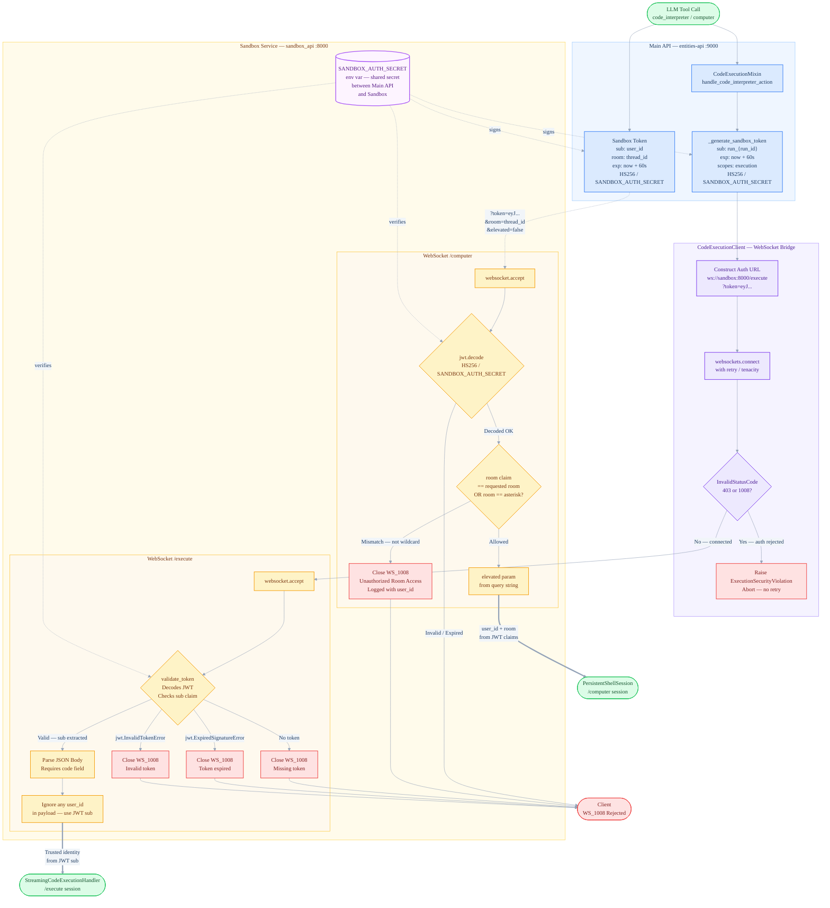

```mermaid
%%{init: {
  "theme": "base",
  "themeVariables": {
    "background": "#f8f9fc",
    "primaryColor": "#dbeafe",
    "primaryTextColor": "#1e3a5f",
    "primaryBorderColor": "#3b82f6",
    "secondaryColor": "#fef3c7",
    "secondaryTextColor": "#78350f",
    "secondaryBorderColor": "#f59e0b",
    "tertiaryColor": "#ede9fe",
    "tertiaryTextColor": "#4c1d95",
    "tertiaryBorderColor": "#7c3aed",
    "nodeTextColor": "#1e293b",
    "edgeLabelBackground": "#f1f5f9",
    "clusterBkg": "#f8faff",
    "clusterBorder": "#cbd5e1",
    "titleColor": "#1e293b",
    "lineColor": "#94a3b8",
    "fontSize": "16px",
    "fontFamily": "Georgia, serif"
  }
}}%%
graph TD
    LLM([LLM Tool Call\ncode_interpreter / computer])
    Rejected([Client\nWS_1008 Rejected])
    ExecSession([StreamingCodeExecutionHandler\n/execute session])
    ShellSession([PersistentShellSession\n/computer session])

    subgraph MainAPI ["Main API — entities-api :9000"]
        direction TB
        Mixin[CodeExecutionMixin\nhandle_code_interpreter_action]
        TokenGen["_generate_sandbox_token\nsub: run_{run_id}\nexp: now + 60s\nscopes: execution\nHS256 / SANDBOX_AUTH_SECRET"]
        ComputerToken["Sandbox Token\nsub: user_id\nroom: thread_id\nexp: now + 60s\nHS256 / SANDBOX_AUTH_SECRET"]
    end

    subgraph ClientBridge ["CodeExecutionClient — WebSocket Bridge"]
        direction TB
        BuildURL["Construct Auth URL\nws://sandbox:8000/execute\n?token=eyJ..."]
        ConnectWS[websockets.connect\nwith retry / tenacity]
        SecurityCheck{InvalidStatusCode\n403 or 1008?}
        Violation[Raise ExecutionSecurityViolation\nAbort — no retry]
    end

    subgraph SandboxService ["Sandbox Service — sandbox_api :8000"]
        direction TB

        subgraph ExecuteEndpoint ["WebSocket /execute"]
            direction TB
            AcceptExec[websocket.accept]
            ValidateExec{validate_token\nDecodes JWT\nChecks sub claim}
            MissingToken[Close WS_1008\nMissing token]
            ExpiredToken[Close WS_1008\nToken expired]
            InvalidToken[Close WS_1008\nInvalid token]
            ParsePayload[Parse JSON Body\nRequires code field]
            IgnoreClientId[Ignore any user_id\nin payload — use JWT sub]
        end

        subgraph ComputerEndpoint ["WebSocket /computer"]
            direction TB
            AcceptComp[websocket.accept]
            DecodeComp{jwt.decode\nHS256 / SANDBOX_AUTH_SECRET}
            RoomCheck{room claim\n== requested room\nOR room == asterisk?}
            UnauthorizedRoom[Close WS_1008\nUnauthorized Room Access\nLogged with user_id]
            ElevatedFlag[elevated param\nfrom query string]
        end

        SharedSecret[("SANDBOX_AUTH_SECRET\nenv var — shared secret\nbetween Main API\nand Sandbox")]
    end

    %% ── /execute flow ──────────────────────────────────────────────
    LLM --> Mixin
    Mixin --> TokenGen
    TokenGen --> BuildURL
    BuildURL --> ConnectWS
    ConnectWS --> SecurityCheck
    SecurityCheck -- "Yes — auth rejected" --> Violation
    SecurityCheck -- "No — connected" --> AcceptExec

    AcceptExec --> ValidateExec
    ValidateExec -- "No token" --> MissingToken
    ValidateExec -- "jwt.ExpiredSignatureError" --> ExpiredToken
    ValidateExec -- "jwt.InvalidTokenError" --> InvalidToken
    MissingToken --> Rejected
    ExpiredToken --> Rejected
    InvalidToken --> Rejected

    ValidateExec -- "Valid — sub extracted" --> ParsePayload
    ParsePayload --> IgnoreClientId
    IgnoreClientId ==> |"Trusted identity\nfrom JWT sub"| ExecSession

    %% ── /computer flow ─────────────────────────────────────────────
    LLM --> ComputerToken
    ComputerToken -.-> |"?token=eyJ...\n&room=thread_id\n&elevated=false"| AcceptComp
    AcceptComp --> DecodeComp
    DecodeComp -- "Invalid / Expired" --> Rejected

    DecodeComp -- "Decoded OK" --> RoomCheck
    RoomCheck -- "Mismatch — not wildcard" --> UnauthorizedRoom
    UnauthorizedRoom --> Rejected

    RoomCheck -- "Allowed" --> ElevatedFlag
    ElevatedFlag ==> |"user_id + room\nfrom JWT claims"| ShellSession

    %% ── shared secret anchor ───────────────────────────────────────
    SharedSecret -. "signs" .-> TokenGen
    SharedSecret -. "signs" .-> ComputerToken
    SharedSecret -. "verifies" .-> ValidateExec
    SharedSecret -. "verifies" .-> DecodeComp

    %% ── class definitions ──────────────────────────────────────────
    classDef main     fill:#dbeafe,stroke:#3b82f6,stroke-width:1.5px,color:#1e3a5f
    classDef worker   fill:#fef3c7,stroke:#f59e0b,stroke-width:1.5px,color:#78350f
    classDef bridge   fill:#ede9fe,stroke:#7c3aed,stroke-width:1.5px,color:#4c1d95
    classDef external fill:#dcfce7,stroke:#22c55e,stroke-width:1.5px,color:#14532d
    classDef danger   fill:#fee2e2,stroke:#ef4444,stroke-width:1.5px,color:#7f1d1d
    classDef secret   fill:#fdf4ff,stroke:#a855f7,stroke-width:2px,color:#581c87

    class Mixin,TokenGen,ComputerToken main
    class AcceptExec,ValidateExec,ParsePayload,IgnoreClientId,AcceptComp,DecodeComp,RoomCheck,ElevatedFlag worker
    class BuildURL,ConnectWS,SecurityCheck bridge
    class LLM,ExecSession,ShellSession external
    class Rejected,MissingToken,ExpiredToken,InvalidToken,InvalidToken,UnauthorizedRoom,Violation danger
    class SharedSecret secret

    style MainAPI       fill:#eff6ff,stroke:#93c5fd,color:#1e3a5f
    style ClientBridge  fill:#f5f3ff,stroke:#a78bfa,color:#4c1d95
    style SandboxService fill:#fffbeb,stroke:#fcd34d,color:#78350f
    style ExecuteEndpoint fill:#fef9ee,stroke:#fbbf24,color:#78350f
    style ComputerEndpoint fill:#fef9ee,stroke:#fbbf24,color:#78350f
```