# Platform Overview

The Platform API lets you build AI assistants that integrate cleanly into your own applications.
Each assistant is a self-contained entity, configured with its own instructions, model, and tools,
and fully decoupled from your application logic.

A single stateful API abstracts across a wide range of open-weight models and inference providers.
One interface, regardless of what is running behind it.

All endpoints are plain REST. The official SDK is recommended for the best developer experience.

## How Entities Works

```mermaid
%%{init: {
  "theme": "base",
  "themeVariables": {
    "background": "#f8f9fc",
    "primaryColor": "#dbeafe",
    "primaryTextColor": "#1e3a5f",
    "primaryBorderColor": "#3b82f6",
    "secondaryColor": "#fef3c7",
    "secondaryTextColor": "#78350f",
    "secondaryBorderColor": "#f59e0b",
    "nodeTextColor": "#1e293b",
    "edgeLabelBackground": "#f1f5f9",
    "titleColor": "#1e293b",
    "lineColor": "#94a3b8",
    "fontSize": "18px",
    "fontFamily": "Georgia, serif"
  }
}}%%
graph LR
    Assistant[Assistant\nInstructions · Tools · Model]
    Thread[Thread\nConversation Session\nMessage History]
    Message[Message\nUser · Assistant\nTool · System]
    Run[Run\nIn-flight State\nTool Invocation · Steps]
    Inference[Inference\nModel Execution\nLocal · Cloud]

    Assistant --> |"scopes"| Thread
    Thread --> |"contains"| Message
    Message --> |"triggers"| Run
    Run --> |"dispatches to"| Inference
    Inference --> |"response appended as"| Message

    classDef main fill:#dbeafe,stroke:#3b82f6,stroke-width:1.5px,color:#1e3a5f
    classDef worker fill:#fef3c7,stroke:#f59e0b,stroke-width:1.5px,color:#78350f
    classDef external fill:#dcfce7,stroke:#22c55e,stroke-width:1.5px,color:#14532d

    class Assistant,Thread main
    class Run,Message worker
    class Inference external
```

## Objects

| Object | Purpose |
|---|---|
| [**Assistant**](https://docs.projectdavid.co.uk/docs/Create-assistant) | A distinct AI entity configured with its own instructions, model, and tools. |
| [**Thread**](https://docs.projectdavid.co.uk/docs/Threads) | A conversation session between a user and an assistant. Stores the full message history and manages context window truncation automatically. |
| [**Message**](https://docs.projectdavid.co.uk/docs/Messages) | An individual turn in a conversation. Each message carries a role (user, assistant, system, or tool) and is stored sequentially within a thread. |
| [**Run**](https://docs.projectdavid.co.uk/docs/Runs) | The in-flight execution state for a given thread. Mediates tool invocation and function calls on behalf of the assistant. Run steps provide a structured trace of each action taken during response generation. |
| **Inference** | Takes the constructed context from the thread and passes it to the selected model. Supports both local inference and a range of cloud providers. |

---

Ready to build? The [Quick Start](/docs/sdk-quick-start) guide walks through a complete inference call from setup to streaming response.